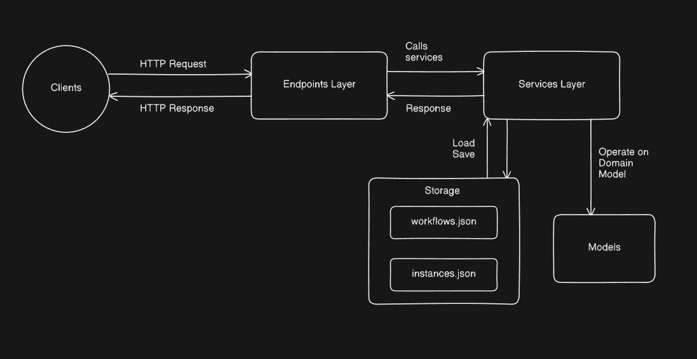

# Configurable Workflow Engine

This project is a .NET 8 backend service that implements a configurable state-machine workflow engine, as per the Infonetica take-home exercise. This is a **lightweight**, **self-contained** workflow engine built with .NET 8 minimal APIs. It allows you to:

* **Define** workflows (states + actions).
* **Start** instances of those workflows, with custom descriptions.
* **Execute** actions to move instances through their states, with full validation.

## System Design


* **Zero‑DB**: uses JSON files (`workflows.json`, `instances.json`)—no external database required.
* **Dynamic workflows**: model new processes at runtime by POSTing JSON definitions.
* **Minimal‑API**: concise, controller‑less endpoints with built‑in JSON binding.
* **Rich metadata**: descriptions, timestamps, and history tracking in each instance.

## Quick Start

1.  **Prerequisites**: .NET 8 SDK.
2. **Clone** the repository and `cd` into it:

   ```bash
   git clone https://github.com/dudegladiator/infonetica_assignment.git Infonetica
   cd Infonetica
   ```
3. **Run** the API:

   ```bash
   dotnet run
   ```
4. API listens on `http://localhost:5246` by default.

## API Endpoints

### Workflow Definitions

| Method | URL                 | Body                      | Success Response     | Error Response                     |
| ------ | ------------------- | ------------------------- | -------------------- | ---------------------------------- |
| POST   | `/definitions`      | `WorkflowDefinition` JSON | `201 Created` + JSON | `400 Bad Request { error: "..." }` |
| GET    | `/definitions`      | —                         | `200 OK` + `[ ... ]` | —                                  |
| GET    | `/definitions/{id}` | —                         | `200 OK` + JSON      | `404 Not Found { error: "..." }`   |

### Workflow Instances (Runtime)

| Method | URL                                      | Body                       | Success Response     | Error Response                     |
| ------ | ---------------------------------------- | -------------------------- | -------------------- | ---------------------------------- |
| POST   | `/definitions/{id}/instances`            | `{ "description": "..." }` | `201 Created` + JSON | `400 Bad Request { error: "..." }` |
| POST   | `/instances/{instId}/actions/{actionId}` | —                          | `200 OK` + JSON      | `400 Bad Request { error: "..." }` |
| GET    | `/instances/{instId}`                    | —                          | `200 OK` + JSON      | `404 Not Found { error: "..." }`   |
| GET    | `/instances`                             | —                          | `200 OK` + `[ ... ]` | —                                  |

> **Note:** These endpoints could be formally defined in a Swagger/OpenAPI specification for interactive documentation and validation, but for simplicity they are listed here in plain markdown.
---


## Example: Hiring Workflow for Harsh Gupta

1. **Define** the `hiring-wf` workflow (save as `hiring-workflow.json`):

```json
{
  "id": "hiring-wf",
  "description": "Infonetica candidate hiring process",
  "states": [
    { "id":"Applied","name":"Applied","isInitial":true,"isFinal":false,"enabled":true,"description":"Candidate submitted application" },
    { "id":"PhoneScreen","name":"Phone Screen","isInitial":false,"isFinal":false,"enabled":true,"description":"Phone interview" },
    { "id":"Onsite","name":"Onsite Interview","isInitial":false,"isFinal":false,"enabled":true,"description":"On‑site loop done" },
    { "id":"OfferExtended","name":"Offer Extended","isInitial":false,"isFinal":false,"enabled":true,"description":"Offer made" },
    { "id":"Hired","name":"Hired","isInitial":false,"isFinal":true,"enabled":true,"description":"Candidate accepted" }
  ],
  "actions": [
    { "id":"ReviewApp","name":"Review Application","enabled":true,"fromStates":["Applied"],"toState":"PhoneScreen","description":"HR review","estimatedMinutes":60 },
    { "id":"DoPhoneScreen","name":"Do Phone Screen","enabled":true,"fromStates":["PhoneScreen"],"toState":"Onsite","description":"Recruiter calls","estimatedMinutes":30 },
    { "id":"ScheduleOnsite","name":"Schedule Onsite","enabled":true,"fromStates":["Onsite"],"toState":"OfferExtended","description":"Book loop","estimatedMinutes":120 },
    { "id":"ExtendOffer","name":"Extend Offer","enabled":true,"fromStates":["OfferExtended"],"toState":"Hired","description":"Send offer","estimatedMinutes":15 }
  ]
}
```

2. **Create** the workflow:

```bash
curl -i -X POST http://localhost:5246/definitions \
  -H "Content-Type: application/json" \
  --data @hiring-workflow.json
```

3. **Start** Harsh’s instance:

```bash
curl -i -X POST http://localhost:5246/definitions/hiring-wf/instances \
  -H "Content-Type: application/json" \
  -d '{"description":"Harsh Gupta for Software Engineer Role (Roll 22IM3FP29, harsh90731@gmail.com, harsh90731@kgpian.iitkgp.ac.in) applied"}'
```

*Response:*

```json
{
  "id": "<INST_ID>",
  "definitionId": "hiring-wf",
  "description": "Harsh Gupta (Roll 22IM3FP29, harsh90731@gmail.com) applied",
  "currentState": "Applied",
  "history": []
}
```

4. **Advance** through the process:

```bash
# Review application
curl -i -X POST http://localhost:5246/instances/<INST_ID>/actions/ReviewApp

# Do phone screen
curl -i -X POST http://localhost:5246/instances/<INST_ID>/actions/DoPhoneScreen

# Schedule onsite
curl -i -X POST http://localhost:5246/instances/<INST_ID>/actions/ScheduleOnsite

# Extend offer
curl -i -X POST http://localhost:5246/instances/<INST_ID>/actions/ExtendOffer
```

5. **Inspect** final status:

```bash
curl -i http://localhost:5246/instances/<INST_ID>
```

You’ll see `"currentState": "Hired"` and a full `history` of steps.

---

## Assumptions & Limitations

* The service uses simple JSON file storage, which is not thread-safe for concurrent writes.
* Error handling provides basic JSON responses with an `error` key.
* Input validation is handled within the service layer.
* **No authentication/authorization**: any client can hit any endpoint.
* **Single‑tenant**: there’s no concept of multiple users or namespaces.
* **Whole‑file writes**: every change rewrites the entire JSON file, so very large workflows or many instances could be slow.
* **No paging or filtering** on the list endpoints (everything is returned in one go).
* **No incremental “add state” or “add action”** endpoints—you must POST the full definition each time.